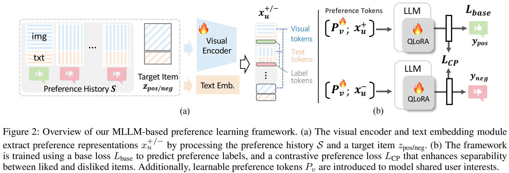

## Learning User Preferences for Image Generation Models

This repository provides the implementation of the paper **"Learning User Preferences for Image Generation Models"**.


<a href='https://learn-user-pref.github.io/'></a>
[](https://arxiv.org/abs/2508.08220) 
[](https://www.python.org/downloads/)
[](https://pytorch.org/)
[](LICENSE)
[](https://github.com/Mowenyii/learn-user-pref)


##  Method Overview

<details><summary>CLICK for the full abstract</summary>

User preference prediction requires a comprehensive and accurate understanding of individual tastes. This includes both surface-level attributes, such as color and style, and deeper content-related aspects, such as themes and composition. However, existing methods typically rely on general human preferences or assume static user profiles, often neglecting individual variability and the dynamic, multifaceted nature of personal taste.   

To address these limitations, we propose an approach built upon Multimodal Large Language Models, introducing contrastive preference loss and preference tokens to learn personalized user preferences from historical interactions. The contrastive preference loss is designed to effectively distinguish between user "likes" and "dislikes", while the learnable preference tokens capture shared interest representations among existing users, enabling the model to activate group-specific preferences and enhance consistency across similar users. 

Extensive experiments demonstrate our model outperforms other methods in preference prediction accuracy, effectively identifying users with similar aesthetic inclinations and providing more precise guidance for generating images that align with individual tastes.
</details>





## Getting Started

### Environment Requirement 
```shell
conda create -n pref python=3.9 -y
conda activate pref
conda install pytorch==2.0.1 torchvision==0.15.2 torchaudio==2.0.2 cudatoolkit=11.7 -c pytorch
pip install -r requirements.txt
```


## Training

The training process is performed in two phases.  In the first phase, the model is trained for preference classification using both the base loss and the contrastive preference loss, enabling it to distinguish between liked and disliked items with clear decision boundaries.  In the second phase, we resume training from the first-phase checkpoint and introduce learnable preference tokens, which allow the model to capture shared patterns across users.  The loss function remains the same across both phases, while the second phase benefits from the enhanced model architecture.

---

### **Stage 1: Base Training**

Run `train.py` to train the base preference model.

**Main arguments**:

* `--train_bz` : Training batch size per device.
* `--eval_bz` : Evaluation batch size.
* `--eval_steps` : Frequency (in steps) of evaluation.
* `--save_steps` : Frequency (in steps) to save checkpoints.
* `--ref_pair_num` : Number of reference image pairs per user.
* `--grad_acc_step` : Gradient accumulation steps.
* `--max_prompt_len` : Maximum prompt token length.
* `--use_prompt` : Whether to include text prompts in training (1 = yes).

**Example**:

```bash
torchrun --nproc_per_node=1 train.py \
    --train_bz 2 \
    --eval_bz 1 \
    --eval_steps 1 \
    --save_steps 1000 \
    --ref_pair_num 8 \
    --grad_acc_step 4 \
    --max_prompt_len 100 \
    --use_prompt 1
```

---

### **Stage 2: Contrastive Fine-Tuning**

Run `train2.py` to fine-tune the Stage 1 checkpoint with **learnable preference tokens**.

**Main arguments**:

* All Stage 1 arguments (above), plus:
* `--length` : Sequence length for preference tokens.
* `--exp_name` : Experiment name for logging.
* `--lora_path` : Path to Stage 1 LoRA checkpoint.

**Example**:

```bash
torchrun --master_port=20676 --nproc_per_node=1 train2.py \
    --train_bz 2 \
    --eval_bz 2 \
    --eval_steps 5000 \
    --save_steps 10000 \
    --ref_pair_num 8 \
    --grad_acc_step 4 \
    --max_prompt_len 100 \
    --use_prompt 1 \
    --length 10 \
    --exp_name exp \
    --lora_path /path/to/stage1/checkpoint/
```

### 3. Evaluation

```bash
python eval.py
```


##  Datasets

We provide the processed datasets used in our experiments at:
👉 [Hugging Face Datasets: wenyii/learn-user-pref](https://huggingface.co/datasets/wenyii/learn-user-pref)

The dataset is derived from **[Pick-a-Pic v2](https://huggingface.co/datasets/yuvalkirstain/pickapic_v2)**, containing user-specific preference annotations (liked vs. disliked images).
We organize the data into **train / validation / test splits**, where each user is associated with a set of reference images and corresponding candidate pairs for evaluation.
This setup allows direct training and benchmarking of preference prediction models as described in our paper.


##  Checkpoints

Pre-trained checkpoints of our models are available at:
👉 [Hugging Face Models: wenyii/learn-user-pref](https://huggingface.co/wenyii/learn-user-pref)


##  Cite Us
```
@article{mo2025learning,
  title={Learning User Preferences for Image Generation Model},
  author={Mo, Wenyi and Ba, Ying and Zhang, Tianyu and Bai, Yalong and Li, Biye},
  journal={arXiv preprint arXiv:2508.08220},
  year={2025}
}
```


##  Acknowledgement

Our code is heavily based on the [ViPer](https://github.com/EPFL-VILAB/ViPer), thanks to all the contributors!